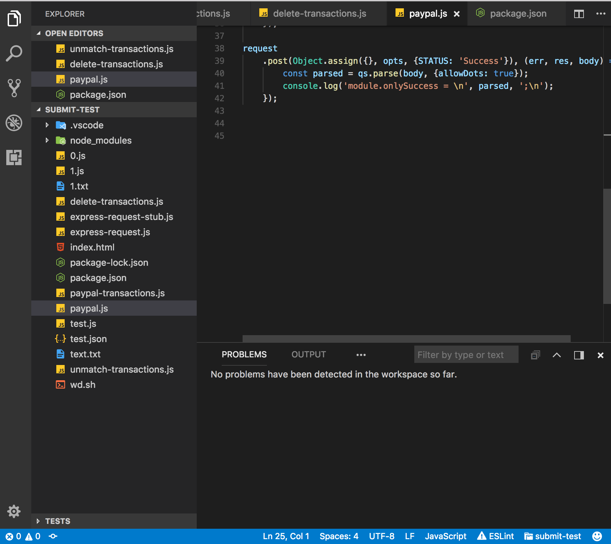
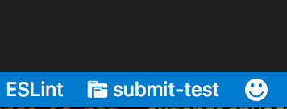

# vscode-project-name-in-statusbar

Simply adds project name in status bar. 
Also provides few options for label template and it's alignment in status bar.





# options

```
    "projectNameInStatusBar.source": {
        "type": "string",
        "enum": [
            "none",
            "folderName"
        ],
        "default": "folderName",
        "description": "Defines way of getting project name"
    },
    "projectNameInStatusBar.align": {
        "type": "string",
        "enum": [
            "left",
            "right"
        ],
        "default": "right",
        "description": "Defines The alignment of the label, requires restart of vscode"
    },
    "projectNameInStatusBar.alignPriority": {
        "type": "number",
        "default": 0,
        "description": "Defines priority of the label. Higher values mean the label should be shown more to the left, requires restart of vscode"
    },
    "projectNameInStatusBar.textStyle": {
        "type": "string",
        "enum": [
            "none",
            "uppercase",
            "lowercase"
        ],
        "default": "none",
        "description": "Defines project name text style inside template"
    },
    "projectNameInStatusBar.template": {
        "type": "string",
        "default": "$(file-submodule) ${project-name}",
        "description": "Defines template of project name placeholder, you can use octicons to decorate your view"
    }
```
